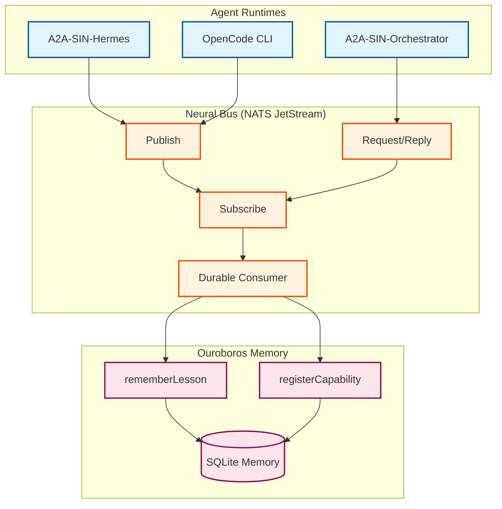

<a name="readme-top"></a>

# OpenSIN Neural Bus

<p align="center">
  <a href="https://github.com/OpenSIN-AI/OpenSIN-Neural-Bus/blob/main/LICENSE">
    
  </a>
  <a href="https://github.com/OpenSIN-AI/OpenSIN-Neural-Bus/stargazers">
    
  </a>
  <a href="https://www.npmjs.com/package/@opensin/neural-bus">
    
  </a>
  <a href="https://www.python.org/downloads/">
    
  </a>
  <a href="https://nats.io">
    
  </a>
  <a href="https://github.com/OpenSIN-AI/OpenSIN-Neural-Bus/actions">
    
  </a>
</p>

<p align="center">
  <a href="#quick-start">Quick Start</a> ·
  <a href="#features">Features</a> ·
  <a href="#architecture">Architecture</a> ·
  <a href="#usage">Usage</a> ·
  <a href="#deploy">Deploy</a> ·
  <a href="#contributing">Contributing</a>
</p>

<p align="center">
  <em>The event-driven nervous system connecting all OpenSIN agents — durable, replayable, and Ouroboros-aware.</em>
</p>

---

## Quick Start

<table>
<tr>
<td width="33%" align="center">
<strong>1. Start NATS</strong><br/><br/>
<code>docker compose up -d nats</code><br/><br/>

</td>
<td width="33%" align="center">
<strong>2. Install</strong><br/><br/>
<code>npm install</code><br/><br/>

</td>
<td width="33%" align="center">
<strong>3. Test</strong><br/><br/>
<code>npm test</code><br/><br/>

</td>
</tr>
</table>

> [!TIP]
> Full setup: `npm install && docker compose up -d nats && npm test` — all tests cover pub/sub, request/reply, durable resume, and replay.

---

## Features

| Capability | Description | Status |
|:---|:---|:---:|
| **JetStream Integration** | Stable connect/reconnect wrapper with validated event envelopes | ✅ |
| **Durable Consumers** | Resume from last acked message after restart — no context loss | ✅ |
| **Request/Reply** | Synchronous request-response pattern over NATS subjects | ✅ |
| **Event Envelopes** | Standardized envelope with correlation IDs and source tracking | ✅ |
| **Subject Taxonomy** | Documented subject hierarchy for all event types | ✅ |
| **Ouroboros Bridge** | Auto-bridge to memory (`rememberLesson`) and capability (`registerCapability`) | ✅ |
| **Python SDK** | SQLite-backed memory with `apply_event_envelope()` | ✅ |
| **Agent Runtime** | Reusable publish/consume patterns for A2A agents | ✅ |

<details>
<summary>Core Exports (TypeScript)</summary>

```ts
import {
  OpenCodeJetStreamClient,   // Stable NATS connection wrapper
  OpenSinAgentRuntime,       // Agent runtime with pub/sub patterns
  SUBJECTS,                  // Subject taxonomy constants
  createEventEnvelope,       // Envelope factory with validation
} from "@opensin/neural-bus";
```

</details>

<p align="right">(<a href="#readme-top">back to top</a>)</p>

---

## Architecture



For detailed subject taxonomy see [docs/jetstream-subject-taxonomy.md](docs/jetstream-subject-taxonomy.md).

<p align="right">(<a href="#readme-top">back to top</a>)</p>

---

## Usage

### Agent Runtime — Publish Events

```ts
const runtime = new OpenSinAgentRuntime({
  agentId: "a2a-sin-hermes",
  sessionId: "session-001",
  bus,
});

await runtime.publishObservation({
  message: "worker booted",
  branch: "feat/new-feature",
});

await runtime.publishLessonLearned({
  context: "JetStream reconnect handling",
  lesson: "Reuse durable consumer name for automatic restart recovery.",
  successRate: 1.0,
});
```

### Durable Consumer Pattern

```ts
const worker = await runtime.consumeAssignedWork(
  {
    subject: SUBJECTS.workflowRequest,
    stream: "OPENSIN_WORKFLOW_EVENTS",
    durableName: "my-worker",
    deliverPolicy: "all",
    ackWaitMs: 500,
  },
  async (event) => {
    console.log("received work", event.payload);
  },
);
```

> [!IMPORTANT]
> Reusing the same `durableName` after restart resumes from the last acked message — no context resend needed!

### Request / Reply

```ts
// Server side
const server = await bus.serveRequests(SUBJECTS.workflowRequest, async (request) => {
  return createEventEnvelope({
    kind: "workflow.reply",
    subject: SUBJECTS.workflowReply,
    source: { id: "a2a-sin-orchestrator", runtime: "agent-runtime" },
    correlationId: request.id,
    payload: { accepted: true },
  });
});

// Client side
const reply = await bus.request(
  createEventEnvelope({
    kind: "workflow.request",
    subject: SUBJECTS.workflowRequest,
    source: { id: "opencode-cli", runtime: "opencode-cli" },
    payload: { task: "resume durable work" },
  }),
);
```

### Ouroboros Bridge

The bus automatically invokes bridge methods when events include `ouroboros.rememberLesson` or `ouroboros.registerCapability`:

| Bridge Method | Purpose | Storage |
|:---|:---|:---|
| `rememberLesson(record)` | Store learned lessons for future agents | SQLite |
| `registerCapability(record)` | Register new agent capabilities | SQLite |

The Python SDK exposes `apply_event_envelope()` for mirroring JetStream envelopes into SQLite-backed memory.

---

## Deploy

| Methode | Target | Zweck |
|:---|:---|:---|
| **Local** | `docker compose up -d nats` | Development with embedded NATS |
| **OCI VM** | `92.5.60.87:4222` | Production NATS JetStream server |
| **Package** | `@opensin/neural-bus` (npm) | Shared library for all agents |

> [!WARNING]
> The production NATS server runs on the OCI VM. All agents must connect to `nats://92.5.60.87:4222` in production.

---

## Documentation

| Document | Purpose |
|:---|:---|
| [Subject Taxonomy](docs/jetstream-subject-taxonomy.md) | Complete NATS subject hierarchy |
| [ARCHITECTURE.md](ARCHITECTURE.md) | System architecture deep dive |
| [CONTRIBUTING.md](CONTRIBUTING.md) | How to contribute |

---

## Changelog

### v1.0.0 (2026-04-14)
- JetStream integration surface with stable connect/reconnect
- Validated event envelopes with correlation IDs
- Durable consumer pattern for restart recovery
- Request/reply helpers over NATS subjects
- Ouroboros bridge points (rememberLesson, registerCapability)
- Python SDK with SQLite-backed memory
- Documented subject taxonomy

---

## Contributing

1. Fork the repository
2. Create your feature branch (`git checkout -b feature/amazing-feature`)
3. Start NATS: `docker compose up -d nats`
4. Install: `npm install`
5. Run tests: `npm test`
6. Commit and push
7. Open a Pull Request

---

## License

MIT. See [LICENSE](LICENSE) for details.

---

<p align="center">
  <sub>Built by <a href="https://github.com/OpenSIN-AI">OpenSIN-AI Fleet</a></sub>
</p>

<p align="right">(<a href="#readme-top">back to top</a>)</p>


---

## Agent Configuration System (v5)

This project is part of the OpenSIN-AI agent ecosystem and uses the unified agent configuration system:

| Datei | Zweck |
|:---|:---|
| `oh-my-sin.json` | Zentrales Team Register |
| `oh-my-openagent.json` | Subagenten-Modelle |
| `my-sin-team-infra.json` | Team Infrastructure Modelle |

### Subagenten-Modelle

| Subagent | Modell |
|:---|:---|
| **explore** | `nvidia-nim/stepfun-ai/step-3.5-flash` |
| **librarian** | `nvidia-nim/stepfun-ai/step-3.5-flash` |

### PARALLEL-EXPLORATION MANDATE

Bei Codebase-Analyse auf grossen Projekten MUESSEN Agenten **5-10 parallele explore + 5-10 librarian-Agenten** starten.

→ [Full Documentation](https://github.com/OpenSIN-AI/OpenSIN-documentation/blob/main/docs/guide/agent-configuration.md)
