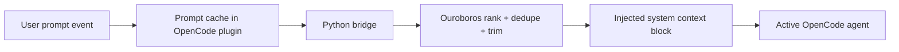

# OpenSIN Ouroboros Context Injection for OpenCode

## Purpose

This project-level OpenCode integration makes procedural lessons from Ouroboros available automatically inside active agent sessions. The goal is simple: if the swarm already learned how to do something, operators should not need to repeat the same instructions in every new session.

## Files involved

- `.opencode/plugins/ouroboros-context.cjs` — OpenCode plugin that listens to prompt events and injects context.
- `sdk/python/ouroboros/memory.py` — ranked lesson retrieval, deduplication, token-budget trimming, and debug packet generation.
- `sdk/python/ouroboros/opencode_context.py` — JSON bridge that the plugin calls through `python3`.

## How OpenCode loads it

OpenCode automatically loads project plugins from:

```text
.opencode/plugins/
```

That means no extra npm package or global installation is required for this repo-specific integration. Start OpenCode in this repository and the hook is available immediately.

## Runtime flow



## Hook behavior

### 1. Prompt capture
The OpenCode plugin listens to `message.updated` and `message.part.updated` events. It records the latest **user-authored** text prompt per session so that retrieval uses the actual task request instead of tool output or synthetic text.

### 2. Ranked retrieval
The Python layer:
- extracts stable keywords from the prompt,
- fetches candidate lessons from SQLite,
- scores them by keyword overlap, full-prompt match, success rate, and recency,
- deduplicates repeated lesson text,
- trims the final list to a token budget.

### 3. Context injection
If at least one lesson survives ranking and trimming, the plugin appends this block to the OpenCode system context:

```text
<opensin_ouroboros_lessons>
...
</opensin_ouroboros_lessons>
```

The injected text is intentionally compact so it helps the active agent without consuming unnecessary context window.

## Configuration

All controls use environment variables so operators can tune the behavior without editing code.

| Variable | Default | Purpose |
|---|---:|---|
| `OUROBOROS_CONTEXT_ENABLED` | `1` | Master on/off switch for the plugin |
| `OUROBOROS_CONTEXT_DEBUG` | `0` | Enables JSON debug artifacts and structured logs |
| `OUROBOROS_DNA_PATH` | `/tmp/ouroboros_dna.sqlite` | Path to the SQLite memory store |
| `OUROBOROS_CONTEXT_MAX_LESSONS` | `5` | Maximum lessons injected into system context |
| `OUROBOROS_CONTEXT_TOKEN_BUDGET` | `400` | Estimated token budget for injected lessons |
| `OUROBOROS_CONTEXT_MIN_SCORE` | `0.2` | Minimum score required for a lesson to qualify |

## Inspectability and debug mode

With `OUROBOROS_CONTEXT_DEBUG=1`, the plugin writes the latest packet for each session to:

```text
.opencode/debug/ouroboros/<session-id>.json
```

Each packet contains:
- the extracted keywords,
- every injected lesson and its score,
- the reasons each lesson matched,
- skipped lessons and why they were skipped,
- the final injected text.

That JSON artifact is the canonical place to inspect why the integration behaved a certain way.

## Testing

Run both the Python and Node tests:

```bash
npm test
```

Coverage split:
- `tests/python/test_ouroboros_memory.py` validates ranking, deduplication, and token trimming.
- `tests/node/ouroboros-context-plugin.test.cjs` validates prompt capture plus OpenCode hook injection behavior.
